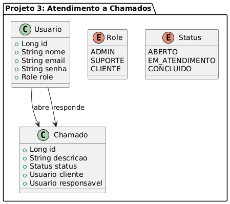

# Projeto Base — API com Spring Boot + JWT

Este projeto foi retirado das sugestões de projetos de conclusão do curso de Java com Spring Boot. https://github.com/Ulpio/projeto-spring-oxetech


 **Sistema de Atendimento a Chamados**

   - Roles: ADMIN, SUPORTE, CLIENTE
   - Permissões: criar chamados, atualizar status, responder
   - UML:
   - 
---

-----

# API de Sistema de Atendimento a Chamados

Este projeto é uma API RESTful desenvolvida em Java com Spring Boot para gerenciar um sistema de chamados de suporte (ticketing), aplicando conceitos avançados de segurança com JSON Web Tokens (JWT) e Controle de Acesso Baseado em Perfis (RBAC).

## Tecnologias Utilizadas

- **Java 17**
- **Spring Boot 3**
- **Spring Security**: Para autenticação e autorização
- **JPA / Hibernate**: Para persistência de dados
- **PostgreSQL**: Banco de dados relacional
- **JWT (JSON Web Tokens)**: Para gerenciamento de sessões stateless
- **Maven**: Para gerenciamento de dependências
- **Docker**: Para orquestração do ambiente de banco de dados

## Funcionalidades Principais

- **Autenticação Segura**: Geração de token JWT no login para acesso aos endpoints protegidos.
- **Controle de Acesso por Perfil (RBAC)**: A API distingue três tipos de usuários (`ADMIN`, `SUPORTE`, `CLIENTE`), cada um com permissões específicas.
- **Gestão de Usuários**: Cadastro de novos usuários e consulta de dados do usuário logado.
- **Ciclo de Vida de Chamados**:
   - Clientes podem abrir novos chamados.
   - Suporte e Admins podem visualizar, atribuir, finalizar e reabrir chamados.
   - Clientes podem visualizar apenas os chamados que eles mesmos criaram.
- **Painel Administrativo**: Rota exclusiva para Admins gerenciarem perfis de usuários.

## Regras de Acesso (Perfis)

| Perfil | Permissões |
| :--- | :--- |
| **CLIENTE** | - **Criar** um novo chamado.<br>- **Visualizar** apenas os seus próprios chamados. |
| **SUPORTE** | - **Visualizar** todos os chamados do sistema.<br>- **Atribuir** um chamado a um responsável.<br>- **Finalizar** e **Reabrir** chamados. |
| **ADMIN** | - Possui **todas as permissões** do perfil `SUPORTE`.<br>- **Alterar o perfil** de outros usuários. |

## Endpoints da API

A URL base da aplicação é `http://localhost:8083`.

-----

### Autenticação

| Verbo | Rota | Descrição | Acesso |
| :--- | :--- | :--- | :--- |
| `POST` | `/auth/login` | Realiza o login e retorna um token JWT. | Público |

-----

### Usuários

| Verbo | Rota | Descrição | Acesso |
| :--- | :--- | :--- | :--- |
| `POST` | `/usuarios` | Cadastra um novo usuário (com perfil `CLIENTE` por padrão). | Público |
| `GET` | `/usuarios/me` | Retorna as informações do usuário logado. | Autenticado |

-----

### Chamados

| Verbo | Rota | Descrição | Acesso |
| :--- | :--- | :--- | :--- |
| `POST` | `/chamados` | Abre um novo chamado. | `CLIENTE` |
| `GET` | `/chamados` | Lista os chamados (clientes veem apenas os seus). | Autenticado |
| `PATCH` | `/chamados/{id}/atribuir/{suporteId}` | Atribui um chamado a um usuário de suporte. | `ADMIN`, `SUPORTE` |
| `PATCH` | `/chamados/{id}/finalizar` | Marca um chamado como "CONCLUÍDO". | `ADMIN`, `SUPORTE` |
| `PATCH` | `/chamados/{id}/reabrir` | Reabre um chamado, mudando o status para "EM\_ATENDIMENTO". | `ADMIN`, `SUPORTE` |

-----

### Admin

| Verbo | Rota | Descrição | Acesso |
| :--- | :--- | :--- | :--- |
| `PATCH` | `/admin/usuarios/{id}/atualizar-role` | Altera o perfil de um usuário. | `ADMIN` |

## Como Executar o Projeto

### Requisitos

- Java 17
- Maven
- Docker

### Passos

1.  **Clone o repositório:**

    ```bash
    git clone https://github.com/LenilsonSantos98/projeto-spring-oxetech.git
    cd projeto-spring-oxetech
    ```

2.  **Inicie o banco de dados com Docker Compose:**
    Este comando irá iniciar um container com o PostgreSQL.

    ```bash
    docker compose up -d
    ```

3.  **Execute a aplicação Spring Boot:**

    ```bash
    ./mvnw spring-boot:run
    ```


-----
  ---

